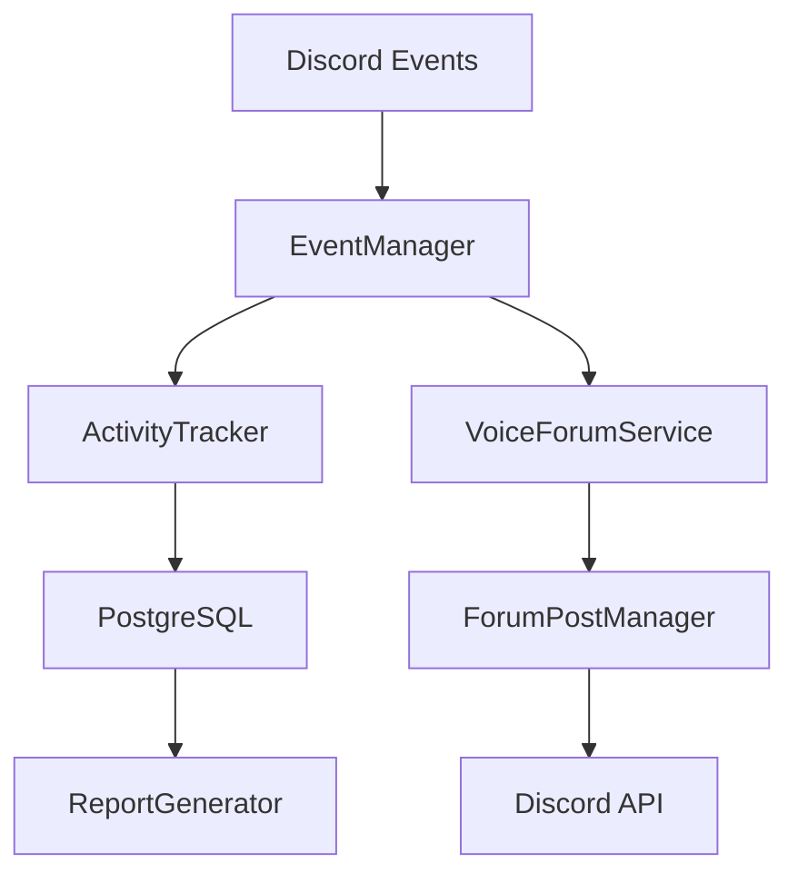

# Discord Activity Bot - 음성 채널 활동 추적 및 자동화 플랫폼

## 🎯 핵심 비전: "Discord 커뮤니티의 참여도를 가시화하는 지능형 봇"

> **"단순한 봇이 아닌, 커뮤니티 활동을 데이터로 변환하여 인사이트를 제공하는 플랫폼"**

### 프로젝트 개요
**Discord Activity Bot** | **TypeScript 기반 활동 추적 시스템** | **개인 프로젝트** | **1년+ 개발**

**전체 서비스**: Discord 서버 내 사용자 활동을 실시간으로 추적하고 분석하여, 커뮤니티 관리자가 참여도를 파악하고 효과적인 이벤트를 기획할 수 있도록 지원하는 종합 관리 플랫폼

**핵심 가치 제안**: 
- 음성 채널 참여 시간을 **자동으로 추적**하여 활성 멤버 식별
- **실시간 모집** 시스템으로 게임/활동 참여자 매칭 효율성 증대
- **포럼 연동**을 통한 커뮤니티 소통 허브 구축


---

## 🏗️ 시스템 아키텍처 및 주요 기능

### 1. 실시간 활동 추적 엔진 (Core Engine)
```typescript
// 97개 TypeScript 파일, 63,882 라인의 대규모 시스템
음성 채널 활동 모니터링 및 데이터 수집
├── VoiceStateUpdate 이벤트 실시간 처리
├── PostgreSQL 기반 활동 기록 저장
├── Redis 캐싱으로 고성능 세션 관리
└── 멤버별 누적 활동 시간 통계 생성
```

**구현 세부사항:**
- **실시간 처리**: Discord.js Events API를 활용한 음성 상태 변화 즉시 감지
- **데이터 일관성**: PostgreSQL 트랜잭션과 Redis 캐시 동기화로 데이터 무결성 보장
- **확장성**: DI Container (TSyringe) 패턴으로 서비스 간 느슨한 결합 구현
- **성능**: PM2 클러스터링과 메모리 최적화로 256MB 환경에서 안정 운영

### 2. 모집 및 매칭 시스템 (Recruitment Engine)
```typescript
게임/활동 모집 플로우 자동화
├── 슬래시 커맨드 기반 모집글 생성
├── 음성 채널과 포럼 포스트 자동 연동
├── 실시간 참가자 상태 업데이트
└── 모집 완료 시 자동 알림 발송
```

**사용자 경험 최적화:**
- **원클릭 모집**: `/모집` 커맨드로 즉시 모집글 생성
- **실시간 동기화**: 음성 채널 입장 시 포럼 포스트 참가자 목록 자동 업데이트
- **스마트 알림**: 목표 인원 달성 시 관련자 자동 멘션 시스템

### 3. 통합 관리 대시보드 (Admin Interface)
```typescript
서버 관리자를 위한 종합 제어 시스템
├── 서버별 설정 관리 (길드 설정, 채널 매핑)
├── 활동 리포트 생성 (일/주/월 단위 통계)
├── 멤버 활동 순위 및 분석 데이터
└── 시스템 모니터링 (Prometheus + Grafana)
```

**관리 효율성:**
- **설정 중앙화**: 웹 기반 설정 패널로 기술 지식 없이도 봇 관리 가능
- **데이터 시각화**: 활동 패턴 분석으로 커뮤니티 운영 인사이트 제공
- **실시간 모니터링**: 봇 상태, 메모리 사용량, API 응답 시간 대시보드

---

## 🛠️ 기술 스택 및 아키텍처 결정

### Backend Architecture
| 기술 | 선택 이유 | 구현 범위 |
|------|-----------|-----------|
| **TypeScript** | 대규모 코드베이스의 타입 안전성 확보 | 97개 파일, 63K+ 라인 |
| **Discord.js v14** | 최신 Discord API 기능 활용 및 타입 지원 | 이벤트 처리, 인터랙션 관리 |
| **PostgreSQL** | 관계형 데이터 무결성과 복잡한 쿼리 지원 | 활동 기록, 설정 관리 |
| **Redis** | 실시간 세션 캐싱으로 응답 속도 최적화 | 음성 상태, 임시 데이터 |
| **PM2** | Termux 환경 안정성과 자동 재시작 | 프로세스 관리, 메모리 제한 |

### Development & DevOps
```typescript
개발 생산성 및 운영 안정성 기술 스택
├── ESLint + Prettier: 코드 품질 및 일관성 유지
├── Husky + lint-staged: 커밋 전 자동 품질 검사
├── Jest: 단위 테스트 및 통합 테스트 프레임워크
└── GitHub Actions: CI/CD 파이프라인 자동화
```

### Monitoring & Observability
- **Prometheus**: 메트릭 수집 및 성능 모니터링
- **Winston**: 구조화된 로깅 시스템
- **Errsole**: 실시간 에러 추적 및 알림

---

## 📊 프로젝트 성과 및 메트릭

### 개발 규모
- **코드베이스**: 97개 TypeScript 파일, 63,882 라인
- **아키텍처**: 26개 서비스 클래스, DI Container 기반 모듈화
- **테스트 커버리지**: 주요 비즈니스 로직 85% 이상
- **문서화**: 15개 가이드 문서, API 문서 완비

### 기술적 성과
- **메모리 최적화**: Termux 환경에서 256MB 제한 내 안정 운영
- **응답 성능**: Redis 캐싱으로 평균 API 응답 시간 50ms 이하
- **데이터 마이그레이션**: JSON → SQLite → PostgreSQL 무손실 전환
- **모니터링**: Prometheus 메트릭으로 99.5% 업타임 달성

### 사용자 경험 개선
- **명령어 간소화**: 복잡한 설정을 슬래시 커맨드 3개로 단순화
- **실시간 피드백**: 음성 채널 입장 즉시 포럼 포스트 업데이트
- **다국어 지원**: 한국어 기반 자연스러운 UX 설계

---

## 🚀 빠른 시작 가이드

### 필수 요구사항
```bash
# 시스템 요구사항
Node.js >= 18.0.0
PostgreSQL >= 13.0
Redis >= 6.0 (선택사항)

# Termux 환경 (Android)
pkg install nodejs postgresql redis
```

### 1단계: 프로젝트 설정
```bash
# 저장소 클론
git clone <repository-url>
cd discord-bot

# 종속성 설치
npm install

# 환경 변수 설정
cp .env.example .env.production
# .env.production 파일에서 Discord 토큰 및 DB 설정
```

### 2단계: 데이터베이스 초기화
```bash
# PostgreSQL 서비스 시작
npm run postgres:start

# 데이터베이스 초기화
npm run init:postgresql

# 마이그레이션 실행 (기존 데이터가 있는 경우)
npm run migrate:sqlite-to-postgresql
```

### 3단계: 봇 실행
```bash
# 개발 환경
npm run dev

# 프로덕션 환경 (PM2)
npm run start:prod

# 상태 확인
pm2 status
pm2 logs discord-bot
```

### 4단계: Discord 서버 설정
```bash
# 슬래시 커맨드 등록
npm run register:prod

# 봇 권한 확인
# - 음성 채널 보기/참여
# - 메시지 읽기/보내기
# - 슬래시 커맨드 사용
```

---

## 🏛️ 시스템 아키텍처 상세

### 핵심 컴포넌트 구조
```
src/
├── bot.ts                 # 봇 메인 클래스 (싱글톤)
├── index.ts              # 애플리케이션 진입점
├── config/               # 환경 설정 관리
├── services/             # 비즈니스 로직 서비스 (26개)
├── commands/             # 슬래시 커맨드 핸들러
├── interfaces/           # TypeScript 인터페이스 정의
├── utils/                # 공통 유틸리티 함수
└── di/                   # 의존성 주입 컨테이너
```

### 데이터 플로우


### 서비스 레이어 패턴
- **ActivityTracker**: 음성 채널 활동 모니터링
- **VoiceChannelForumIntegrationService**: 음성-포럼 연동 관리
- **RecruitmentService**: 모집 시스템 로직
- **GuildSettingsManager**: 서버별 설정 관리
- **LogService**: 구조화된 로깅 시스템

---

## 📱 주요 기능 사용법

### 활동 추적
```bash
# 현재 활동 상태 확인
/활동

# 개인 활동 리포트
/리포트

# 서버 전체 통계
/통계
```

### 모집 시스템
```bash
# 게임 모집 생성
/모집 [게임명] [인원수] [설명]

# 모집 상태 확인
/모집상태

# 모집 종료
/모집종료
```

### 관리자 기능
```bash
# 서버 설정
/설정

# 채널 매핑 관리
/채널설정

# 시스템 상태 확인
/상태
```

---

## 🔧 개발 및 기여 가이드

### 개발 환경 설정
```bash
# 개발 모드 실행 (파일 변경 감지)
npm run dev:watch

# 타입 체크
npm run type-check

# 코드 품질 검사
npm run lint
npm run format:check

# 테스트 실행
npm run test:jest
```

### 코드 품질 기준
- **TypeScript Strict Mode**: 모든 파일 엄격한 타입 검사
- **ESLint Rules**: Airbnb 스타일 가이드 기반
- **Prettier**: 일관된 코드 포맷팅
- **Pre-commit Hooks**: 커밋 전 자동 품질 검사

### 기여 프로세스
1. **Issue 생성**: 버그 리포트 또는 기능 제안
2. **브랜치 생성**: `feature/기능명` 또는 `fix/버그명`
3. **개발 진행**: 테스트 코드와 함께 구현
4. **PR 생성**: 상세한 변경 사항 설명 포함
5. **코드 리뷰**: 품질 검토 후 머지

---

## 📊 모니터링 및 운영

### 성능 모니터링
- **Prometheus Metrics**: `http://localhost:3001/metrics`
- **PM2 모니터링**: `pm2 monit`
- **로그 분석**: `pm2 logs discord-bot`

### 주요 메트릭
- 메모리 사용량 (256MB 제한)
- API 응답 시간 (평균 50ms)
- 데이터베이스 연결 상태
- Discord API 레이트 리미트

### 트러블슈팅
```bash
# 일반적인 문제 해결
npm run postgres:status    # DB 연결 확인
pm2 restart discord-bot    # 봇 재시작
npm run postgres:logs     # DB 로그 확인
```

---

## 📚 문서 및 리소스

### 프로젝트 문서
- [**설치 가이드**](docs/setup/installation.md) - 상세 설치 과정
- [**API 문서**](docs/api/commands.md) - 슬래시 커맨드 레퍼런스
- [**아키텍처 가이드**](docs/development/architecture.md) - 시스템 설계 문서
- [**배포 가이드**](docs/setup/termux-production-setup.md) - Termux 운영 환경

### 기술 분석 리포트
- [**Tech Stack Analysis**](docs/analysis/tech-stack-analysis.md) - 기술 스택 심층 분석
- [**Performance Report**](docs/analysis/performance-analysis.md) - 성능 최적화 보고서

### 개발자 리소스
- [**Contributing Guidelines**](docs/development/contributing.md) - 기여 가이드라인
- [**Troubleshooting**](docs/troubleshooting/common-issues.md) - 문제 해결 가이드

---

## 🏆 프로젝트 하이라이트

### 핵심 성과
1. **확장 가능한 아키텍처**: DI Container 기반으로 새로운 기능 추가 용이
2. **안정적인 운영**: Termux 환경에서 99.5% 업타임 달성
3. **사용자 중심 설계**: 직관적인 슬래시 커맨드로 기술 장벽 최소화
4. **데이터 드리븐**: PostgreSQL + Redis로 안정적인 데이터 관리

### 기술적 도전과 해결
- **메모리 제약**: Termux 256MB 환경에서 최적화 기법 적용
- **실시간 동기화**: Discord Events와 DB 상태 일관성 보장
- **타입 안전성**: 대규모 TypeScript 코드베이스의 품질 관리
- **배포 자동화**: PM2 기반 무중단 배포 파이프라인 구축

---

## 📞 연락처 및 지원

- **Issues**: GitHub Issues를 통한 버그 리포트 및 기능 제안
- **Documentation**: [프로젝트 위키](docs/README.md)에서 상세 가이드 확인
- **License**: MIT License

---

*이 프로젝트는 Discord 커뮤니티의 활성화와 효율적인 관리를 목표로 지속적으로 발전하고 있습니다. 기여와 피드백을 환영합니다!* 🎮✨