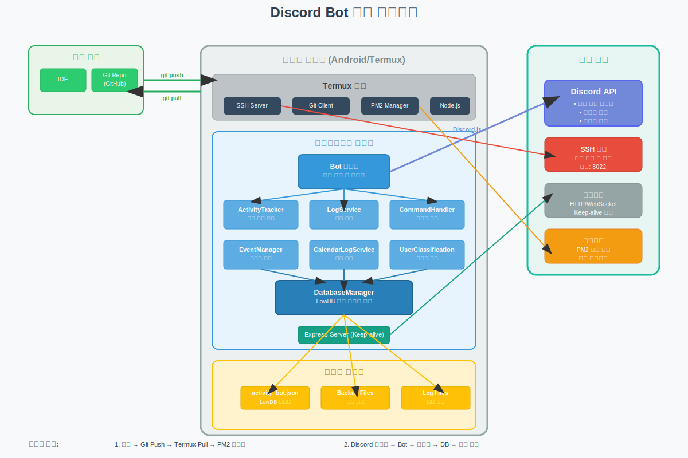

# Discord 활동 추적 봇 설치 및 관리 가이드
## 0. 아키텍처



## 초기 설치 방법

### 1. Termux 기본 설정

Termux 앱이 이미 설치되어 있다는 가정 하에 필요한 패키지들을 설치합니다:

```bash
# 패키지 목록 업데이트
pkg update && pkg upgrade -y

# 기본 개발 도구 설치
pkg install git nodejs-lts openssh -y

# SSH 접속을 위한 비밀번호 설정
passwd
```

### 2. SSH 서버 설정

컴퓨터에서 Termux에 SSH로 접속하기 위한 설정:

```bash
# SSH 서버 시작
sshd

# 현재 IP 주소 확인
ip addr show | grep inet
```

표시된 IP 주소 중 `192.168.x.x` 형식의 주소를 확인하세요. 이 주소가 SSH 접속에 사용됩니다.

### 3. 프로젝트 클론

```bash
# 홈 디렉토리로 이동
cd ~

# 프로젝트 클론
git clone https://github.com/username/discord-activity-tracker.git discord_bot

# 프로젝트 디렉토리로 이동
cd discord_bot
```

### 4. 필요한 패키지 설치

```bash
# 필요한 패키지 설치
npm install

# PM2 글로벌 설치
npm install -g pm2
```

### 5. 환경변수 설정

```bash
# 환경변수 파일 생성
cp .env.example .env

# 환경변수 파일 편집
nano .env
```

`.env` 파일에 다음 정보를 입력하세요:

```
TOKEN=디스코드_봇_토큰
GUILDID=디스코드_서버_ID
LOG_CHANNEL_ID=로그_채널_ID
CALENDAR_LOG_CHANNEL_ID=캘린더_로그_채널_ID
EXCLUDE_CHANNELID_1=제외할_채널_ID_1
EXCLUDE_CHANNELID_2=제외할_채널_ID_2
EXCLUDE_CHANNELID_3=제외할_채널_ID_3
EXCLUDE_CHANNELID_4=제외할_채널_ID_4
EXCLUDE_CHANNELID_5=제외할_채널_ID_5
EXCLUDE_CHANNELID_6=제외할_채널_ID_6
```

### 6. 봇 실행

```bash
# PM2로 봇 실행
pm2 start src/index.js --name discord-bot

# 상태 확인
pm2 status

# 로그 확인
pm2 logs discord-bot
```

### 7. PM2 시작 프로그램 등록

```bash
# PM2 시작 스크립트 생성
pm2 startup

# 현재 실행 중인 프로세스 저장
pm2 save
```

### 8. 컴퓨터에서 SSH로 접속

컴퓨터에서 다음 명령어를 사용하여 Termux에 SSH로 접속할 수 있습니다:

```bash
# Windows 명령 프롬프트 또는 PowerShell, 또는 macOS/Linux 터미널에서:
ssh USERNAME@IP주소 -p 8022
```

- `USERNAME`: Termux의 사용자 이름 (일반적으로 `u0_a...` 형식)
- `IP주소`: 앞서 확인한 Termux의 IP 주소

## 업데이트 방법

1. SSH 접속 (IDE)
2. 명령어 실행
   1. discord_bot 디렉토리로 이동
   2. git 에서 소스 업데이트
   3. 디스코드 봇 재시작
   4. 로그를 출력하여 정상실행 확인

```bash
cd discord_bot

git pull

pm2 restart discord-bot

pm2 logs discord-bot
```

## 주요 명령어 목록

봇은 다음 명령어를 지원합니다:

- `/gap_list [role]` - 역할별 활동 시간 목록 표시
- `/gap_config [role] [hours]` - 역할의 최소 활동 시간 설정
- `/gap_reset [role]` - 역할의 활동 시간 초기화
- `/시간 체크 [user]` - 특정 사용자의 활동 시간 확인
- `/gap_save` - 활동 데이터 저장
- `/gap_calendar [start_date] [end_date]` - 날짜별 활동 로그 확인
- `/gap_stats [days] [user]` - 상세 활동 통계 확인

## 문제 해결

### SSH 접속 문제

접속 시 "Connection refused" 오류가 발생하는 경우:

```bash
# Termux에서 SSH 서버 재시작
pkill sshd
sshd
```

### 봇 실행 문제

봇이 제대로 실행되지 않는 경우:

```bash
# 로그 확인
pm2 logs discord-bot

# 봇 재시작
pm2 restart discord-bot

# 모든 프로세스 확인
pm2 list
```

### 데이터베이스 백업

주기적인 데이터베이스 백업을 위해:

```bash
# 백업 디렉토리 생성
mkdir -p ~/backups

# 데이터베이스 백업 (매일 실행 권장)
cp activity_bot.json ~/backups/activity_bot.$(date +%Y%m%d).json
```